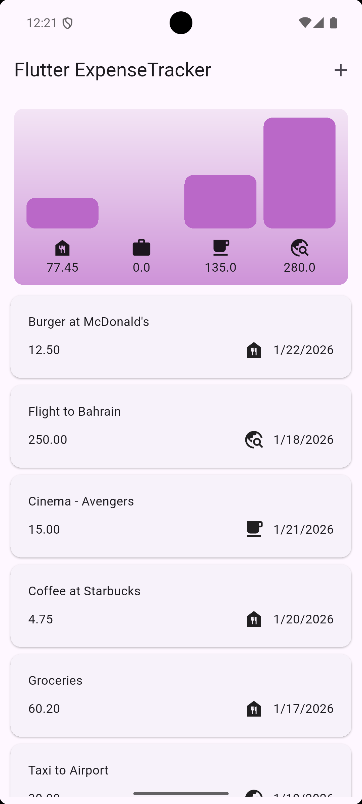
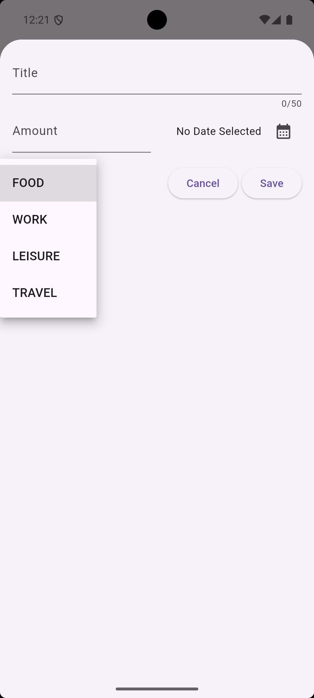
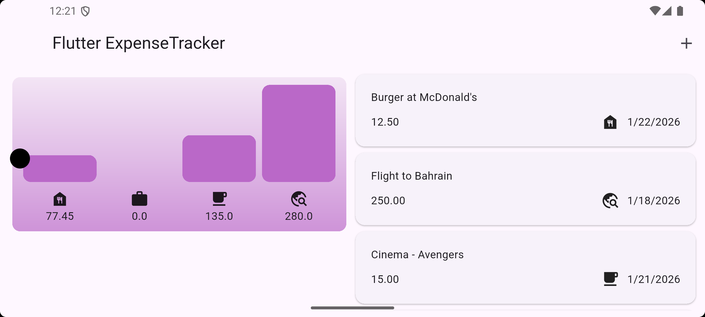

# Flutter Expense Tracker 💰

A responsive and adaptive Flutter application to track personal expenses.  
Users can **add, view, and delete expenses** and see **charts** summarising spending.

---

## Features

- Add, edit, and delete expenses
- Responsive layout for **portrait and landscape**
- Adaptive UI for **iOS and Android**
- Visual charts for expenses
  
---

## Screenshots

  
  
  

---
